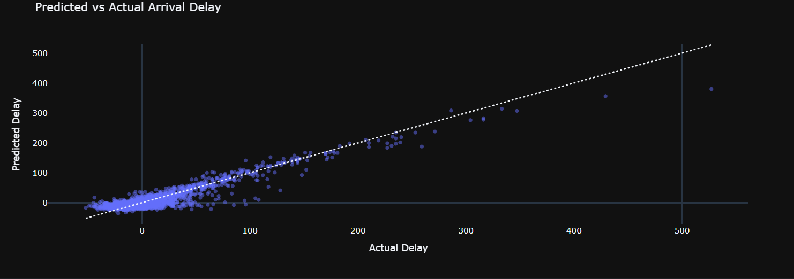

# Tests (10k lignes)

Ce qu'on cherche à déterminer : **Retard à l'arrivée** (ARRIVAL_DELAY)

## 1. Toutes les colonnes

Pour ce premier test, on a pris toutes les colonnes qu'on jugeait nécessaires.

Liste des colonnes : 
- Mois (MONTH)
- Jour (DAY)
- Jour dans la semaine (DAY_OF_WEEK)
- Compagnie aérienne (AIRLINE)
- Aéroport de départ (ORIGIN_AIRPORT)
- Aéroport de destination (DESTINATION_AIRPORT)
- Heure de départ (SCHEDULED_DEPARTURE)
- Retard de départ (DEPARTURE_DELAY)
- Heure d'arrivée (SCHEDULED_ARRIVAL)
- Distance du vol (DISTANCE)

Score Train R² -- 96.73 % | MAE = 3.91 min  
Score Test  R² -- 79.57 % | MAE = 10.44 min

## 2. Colonnes principales

On s'est basé sur les 4 colonnes qu'on a jugé les plus importantes.

Liste des colonnes : 
- Compagnie aérienne (AIRLINE)
- Aéroport de départ (ORIGIN_AIRPORT)
- Aéroport de destination (DESTINATION_AIRPORT)
- Retard de départ (DEPARTURE_DELAY)

Score Train R² -- 97.59 % | MAE = 3.86 min  
Score Test  R² -- 86.19 % | MAE = 9.85 min