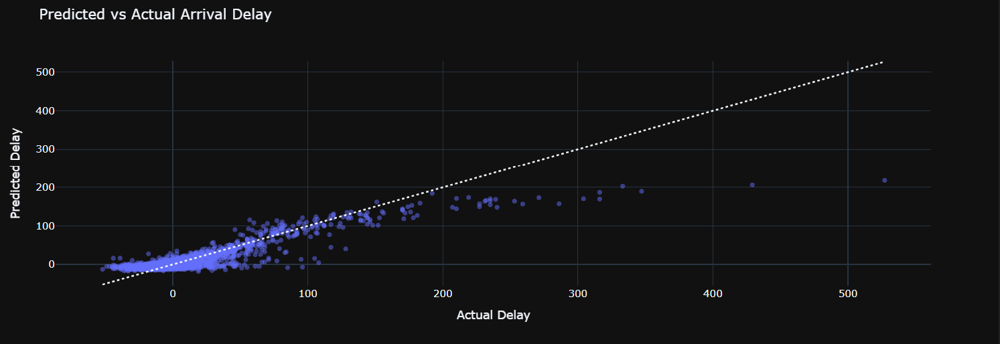

# Tests (10k lignes)

Ce qu'on cherche à déterminer : **Retard à l'arrivée** (ARRIVAL_DELAY)

Stats du modèle de base :

```python
model = Pipeline([
    ("preprocess", preprocessor),
    ("rf", RandomForestRegressor(
        n_estimators=100, # Tree number
        random_state=0,
        max_features=2,
    ))
])
```

## 1. Toutes les colonnes

Pour ce premier test, on a pris toutes les colonnes qu'on jugeait nécessaires.

Liste des colonnes : 
- Mois (MONTH)
- Jour (DAY)
- Jour dans la semaine (DAY_OF_WEEK)
- Compagnie aérienne (AIRLINE)
- Aéroport de départ (ORIGIN_AIRPORT)
- Aéroport de destination (DESTINATION_AIRPORT)
- Heure de départ (SCHEDULED_DEPARTURE)
- Retard de départ (DEPARTURE_DELAY)
- Heure d'arrivée (SCHEDULED_ARRIVAL)
- Distance du vol (DISTANCE)



Score Train R² -- 96.73 % | MAE = 3.91 min <br>
Score Test  R² -- 79.57 % | MAE = 10.44 min

## 2. Colonnes principales

On s'est basé sur les 4 colonnes qu'on a jugé les plus importantes.

Liste des colonnes : 
- Compagnie aérienne (AIRLINE)
- Aéroport de départ (ORIGIN_AIRPORT)
- Aéroport de destination (DESTINATION_AIRPORT)
- Retard de départ (DEPARTURE_DELAY)


Score Train R² -- 97.59 % | MAE = 3.86 min <br>
Score Test  R² -- 86.19 % | MAE = 9.85 min


### 3. En modifiant les statistiques du modèle

```python
model = Pipeline([
    ("preprocess", preprocessor),
    ("rf", RandomForestRegressor(
        n_estimators=100, # Tree number
        random_state=0,
        max_features=4,
        max_depth=5, # Node number
    ))
])
```

Score Train R² -- 87.93 % | MAE = 8.99 min <br>
Score Test  R² -- 87.80 % | MAE = 9.22 min


### 4. En supprimant le retard au départ du vol

Nous avons essayé de complexifier le model en enlevant le temps de retard lié au départ. <br>
On remarque que notre modèle se base très fortement sur le temps de retard lié au départ.

Liste des colonnes : 
- Compagnie aérienne (AIRLINE)
- Aéroport de départ (ORIGIN_AIRPORT)
- Aéroport de destination (DESTINATION_AIRPORT)


Score Train R² -- 5.75 % | MAE = 20.83 min <br>
Score Test  R² -- 0.36 % | MAE = 21.81 min